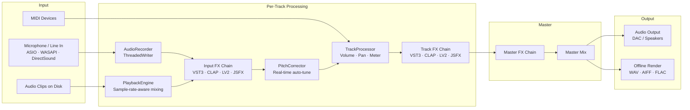
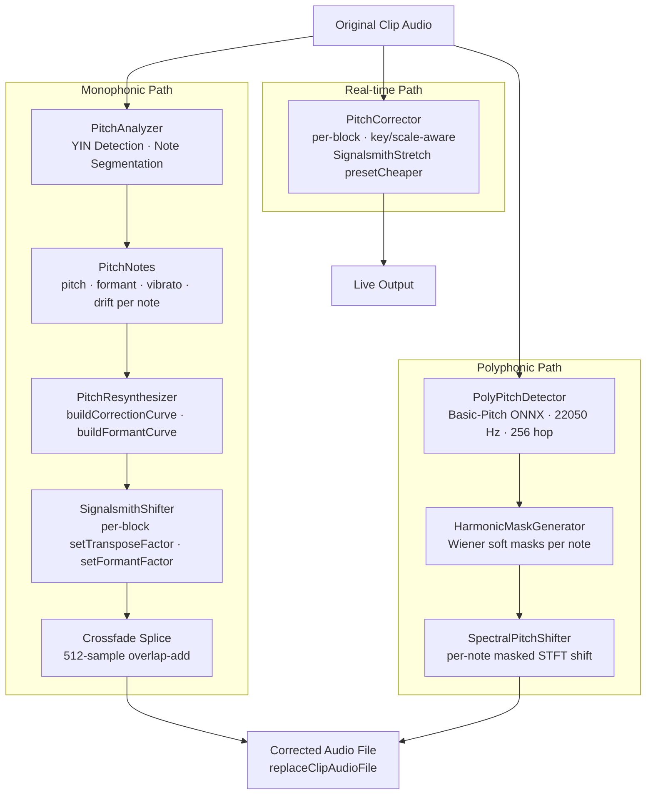
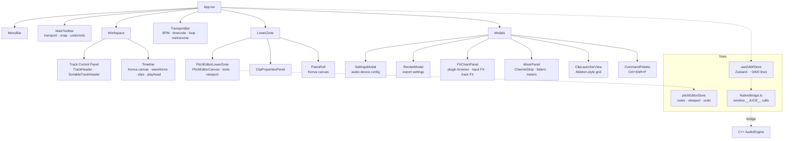
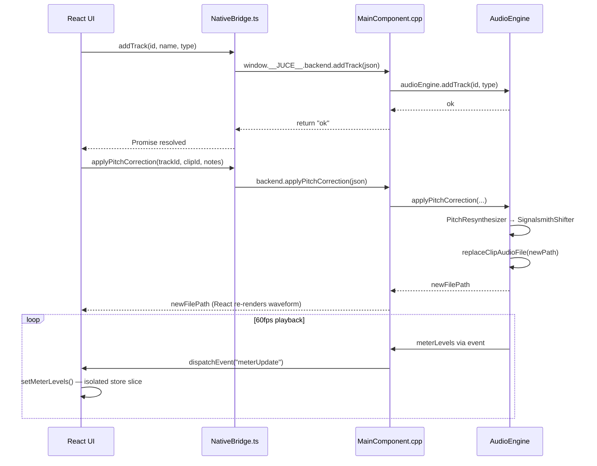

<p align="center">
  
  <h1 align="center">OpenStudio</h1>
</p>

<p align="center">
  A professional-grade DAW built with a <strong>JUCE C++ audio engine</strong> and a <strong>React/TypeScript UI</strong> — shipping natively on Windows and macOS.
</p>

<p align="center">
  
  
  
  
  
</p>

### Project and Preset Formats
- Project files save as `.osproj` and continue opening legacy `.s13` sessions
- Theme exports use `.ostheme`
- Built-in FX presets use `.ospreset`
- Peak cache files use `.ospeaks`

### Release Packaging
- Windows ships as a standard installer
- macOS ships as a free degraded unsigned DMG for v1
- Automatic update metadata is served from `https://openstudio.org.in`
- Optional AI stem-separation tools install later from inside the app and are not bundled in the base download

---

## macOS installation debugging
- This command needs to be ran on macOS after installation through installer to un-quarantine the app and use it
- Otherwise the app would be shown as damaged or broken in macOS
```bash
xattr -dr com.apple.quarantine /Applications/OpenStudio.app
```

## What is OpenStudio?

**OpenStudio** is a hybrid DAW with a high-performance C++ audio engine and a fully hardware-accelerated React frontend rendered inside a native desktop application. It combines the audio processing power of JUCE with the flexibility and speed of modern web UI tooling — no Electron, no Chromium overhead, just a native embedded web UI on top of the audio engine.

<!-- Replace with an actual screenshot once available -->
<!-- <p align="center">
  
</p> -->

---

## Architecture

```
C++ (JUCE) Backend                React/TypeScript Frontend
┌─────────────────────────┐       ┌──────────────────────────────┐
│ AudioEngine              │◄─────►│ NativeBridge.ts              │
│ PlaybackEngine           │       │   (window.__JUCE__ bridge)   │
│ AudioRecorder            │       ├──────────────────────────────┤
│ TrackProcessor           │       │ useDAWStore (Zustand)         │
│ PluginManager            │       ├──────────────────────────────┤
│ MIDIManager              │       │ Timeline (Konva canvas)       │
│ Metronome                │       │ MixerPanel / ChannelStrip     │
│ PitchAnalyzer            │       │ PitchEditorLowerZone          │
│ PitchResynthesizer       │       │ PianoRoll / FXChainPanel      │
│ SignalsmithShifter       │       │ TransportBar / MenuBar        │
│ PitchCorrector           │       │ PluginBrowser / RenderModal   │
│ StemSeparator            │       └──────────────────────────────┘
│ ARAHostController        │
└─────────────────────────┘
```

The **C++ backend** handles all audio I/O, recording, plugin hosting, MIDI device management, metering, pitch correction, and offline rendering. The **React frontend** handles all UI, state, canvas-based timeline, keyboard shortcuts, drag-and-drop, and project save/load. They communicate via a synchronous bridge exposed through `window.__JUCE__`.

---

## Flow Charts

### Audio Signal Chain (Input → Output)



---

### Pitch Correction Pipeline



---

### Frontend Component Tree



---

### JS ↔ C++ Bridge Data Flow



---

## Features

### Audio Engine
- **ASIO / WASAPI / DirectSound** driver support
- Multi-track audio recording with thread-safe `ThreadedWriter`
- Sample-rate-aware clip playback with linear interpolation
- Per-track **Input FX chain** + **Track FX chain** + **Master FX chain**
- PRO DAW-inspired **multi-resolution peak cache** (`.ospeaks` sidecar files, with legacy `.s13peaks` support)
- Offline render/export to WAV, AIFF, FLAC at 16/24/32-bit

### Plugin Hosting
- **VST3**, **CLAP**, and **LV2** plugin formats
- Native plugin editor window management
- ARA plugin hosting (e.g. Melodyne, RePitch)
- JSFX / Lua script-based processors with `@gfx` rendering
- Built-in effects: EQ, compressor, stereo tool, delay, reverb, and more

### Pitch Editor
- **Graphical pitch editor** (Melodyne/VariAudio-style) — analyze, display, and redraw pitch curves per note
- **Real-time auto-tune** corrector (built-in pitch corrector FX) — key/scale-aware, inserted as an FX plugin
- **Signalsmith Stretch** (MIT) as the default pitch engine — native stereo, formant-preserving, offline quality
- **Polyphonic pitch detection** via Spotify's Basic-Pitch ONNX model
- Formant shift, vibrato, drift, and transition controls per note

### MIDI
- MIDI device enumeration and input routing
- Piano Roll editor with Konva canvas
- Virtual 88-key on-screen keyboard
- Per-track MIDI clip storage with time-range queries
- Metronome with BPM, time signature, and accent patterns

### Timeline & UI
- Konva canvas-based timeline: waveforms, clips, rulers, zoom, drag, multi-selection
- Mixer panel with channel strips, faders, pan, solo/mute, metering
- AI stem separation (vocals / drums / bass / other) via optional in-app AI Tools install
- Automation lanes with envelope editing
- Clip launcher (Ableton-style grid)
- Full undo/redo via CommandManager for all data-modifying actions
- Command palette (`Ctrl+Shift+P`), keyboard shortcuts modal, action registry
- PRO DAW theme import/export (`.PRO DAWTheme` → `.ostheme`, with legacy `.s13theme` import support)

---

## Built-In Effects

| Effect | Description |
|--------|-------------|
| EQ | Per-channel graphical equalizer |
| Compressor | Dynamic range compression |
| Reverb | Algorithmic reverb |
| Delay | Stereo delay with feedback and filtering |
| Stereo Tool | Volume, pan, stereo width |
| Crusher | Bit-depth and sample-rate reduction |
| Pitch Corrector | Real-time key/scale-aware auto-tune |
| JSFX Processor | PRO DAW-compatible JSFX / Lua scripts |

---

## Build & Run

### Requirements

- **Windows 10/11** (x64) for the full local toolchain documented below
- **macOS** release packaging is supported in CI/release tooling, with unsigned DMG distribution for v1
- [CMake](https://cmake.org/) ≥ 3.22
- [Visual Studio 2022](https://visualstudio.microsoft.com/) with C++ workload
- [Node.js](https://nodejs.org/) ≥ 18
- [Python](https://python.org/) ≥ 3.10
- [NASM](https://nasm.us/) (required for YSFX) — add to `PATH`

### Quick Start

```bash
# Clone the repo
git clone https://github.com/your-org/studio13-v3.git && cd studio13-v3

# Full dev build: installs deps, builds C++ Debug, starts Vite HMR, launches app
python build.py dev --run
```

### Partial Rebuilds

```bash
# Frontend only — no C++ rebuild needed for UI changes
cd frontend && npm run dev

# C++ only — Debug
cmake --build build --config Debug

# C++ only — Release
cmake --build build --config Release

# Production — embedded frontend + Release C++ → single .exe
python build.py prod
```

---

## Tech Stack

### C++ Backend

| Library | Purpose |
|---------|---------|
| [JUCE 8](https://juce.com/) | Audio engine, plugin hosting, WebBrowserComponent |
| [Signalsmith Stretch](https://github.com/Signalsmith-Audio/signalsmith-stretch) | MIT — pitch shifting with formant preservation |
| [RubberBand](https://breakfastquay.com/rubberband/) | R3 engine, alternative pitch shifter |
| [YSFX](https://github.com/jpcima/ysfx) | JSFX / Lua script processor |
| [ONNX Runtime](https://onnxruntime.ai/) | Basic-Pitch polyphonic pitch detection |
| [sol2](https://github.com/ThePhD/sol2) | Lua scripting engine bindings |
| [WebView2](https://developer.microsoft.com/en-us/microsoft-edge/webview2/) | Embedded browser for the Windows React UI |
| ASIO SDK | Low-latency audio I/O |

### React Frontend

| Library | Purpose |
|---------|---------|
| [React 18](https://react.dev/) + TypeScript | UI framework |
| [Zustand](https://github.com/pmndrs/zustand) | Global state management |
| [react-konva](https://konvajs.org/) | Canvas-based timeline and piano roll |
| [Tailwind CSS v4](https://tailwindcss.com/) | Styling with custom `daw-*` color tokens |
| [@dnd-kit](https://dndkit.com/) | Drag-and-drop track reordering |
| [Vite](https://vitejs.dev/) | Dev server + production bundler |

---

## Project Structure

```
repo-root/
├── Source/          # C++ audio engine, plugin hosting, pitch pipeline
├── frontend/        # React/TypeScript UI (Vite, Tailwind, Zustand, Konva)
├── resources/       # ONNX models, presets, icons
├── tools/           # ffmpeg.exe, stem separator, setup scripts
├── build/           # CMake output (generated)
├── CMakeLists.txt   # C++ build config (JUCE, ASIO, WebView2, VST3, ONNX)
└── build.py         # Orchestrator: cmake + npm + Vite dev server
```

---

## Roadmap

### In Progress
- [ ] Graphical pitch editor — Melodyne/VariAudio parity (vibrato tool, multi-note operations)
- [ ] Polyphonic pitch correction rewrite with Signalsmith Stretch
- [ ] ARA2 deep integration

### Planned
- [ ] MIDI 2.0 support
- [ ] Score / notation view
- [ ] Linux release path
- [ ] Plugin sandboxing

### Completed
- [x] VST3 / CLAP / LV2 plugin hosting
- [x] ARA plugin hosting controller
- [x] Signalsmith Stretch pitch engine (formant-preserving, native stereo)
- [x] Real-time auto-tune pitch corrector
- [x] Polyphonic pitch detection (Basic-Pitch ONNX)
- [x] PRO DAW-style multi-resolution peak cache
- [x] Optional AI stem separation install flow
- [x] JSFX / Lua `@gfx` rendering
- [x] PRO DAW theme import/export
- [x] Offline render (WAV / AIFF / FLAC, 16/24/32-bit)
- [x] Clip launcher (Ableton-style grid)
- [x] Automation lanes
- [x] Full undo/redo for all data-modifying actions
- [x] Command palette

---

## License

OpenStudio is currently distributed in this repository under AGPLv3-compatible terms. See `LICENSE` and `THIRD_PARTY_LICENSES.md` for the current licensing and dependency notices.
