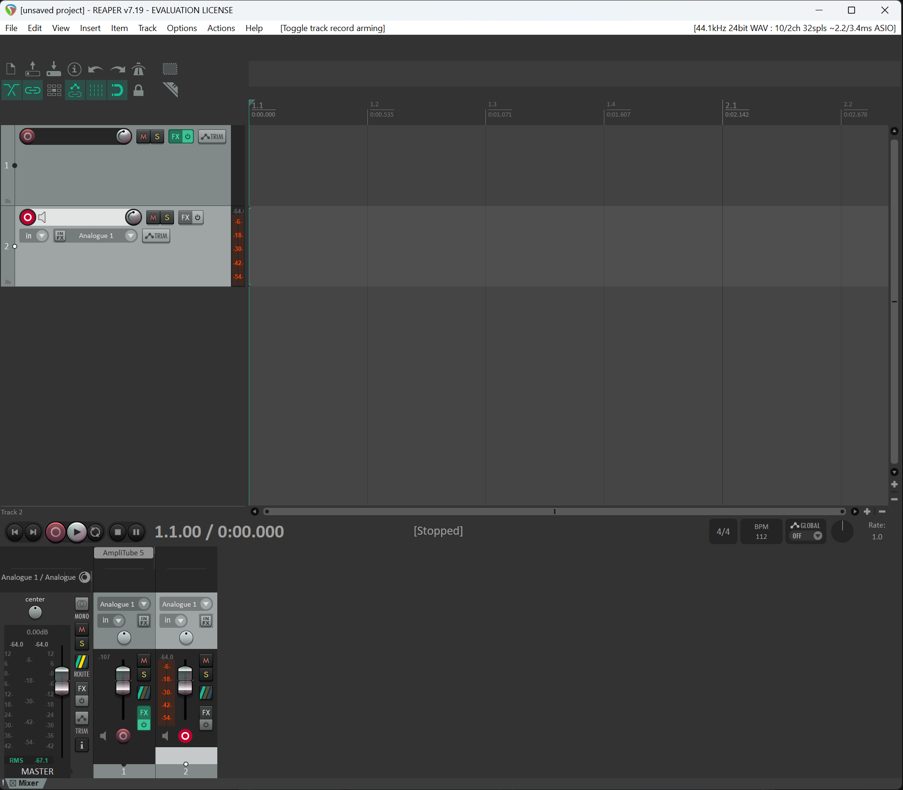

# Studio13

**Studio13** is a next-generation hybrid Digital Audio Workstation (DAW) that combines the raw performance of **C++ & JUCE** for audio processing with the modern, reactive UI capabilities of **React & Vite**.



## 🚀 Key Features

- **Hybrid Architecture**: Logic and DSP in C++, UI in React.
- **Audio & MIDI**: Import audio clips, record, and sequence MIDI.
- **FX Chains**: VST3 plugin support with flexible routing on tracks and master channel.
- **Non-Linear Editing**: Full timeline with clip manipulation, looping, and history (Undo/Redo).
- **Project Management**: Save and load projects (`.s13` format).
- **Smart Workflows**: Single-command development environment.

## 🛠️ Tech Stack

- **Backend**: C++20, JUCE Framework (Audio Engine, Plugin Hosting)
- **Frontend**: React, TypeScript, Vite, Tailwind CSS (UI)
- **Bridge**: Custom efficient JSON/Binary bridge between C++ and WebView.
- **Build System**: CMake & Python

## 📦 Getting Started

### Prerequisites

Ensure you have the following installed:

- [Python 3.x](https://www.python.org/)
- [Node.js](https://nodejs.org/)
- [CMake](https://cmake.org/)
- C++ Compiler (MSVC on Windows, Clang on macOS)

### Development Workflow

We use a unified build script to manage the hybrid environment.

**1. Fast Development (Hot Reload)**
Run the full environment with a single command. This starts the Vite dev server and the C++ backend.

```bash
python build.py dev --run
```

- **UI changes** apply instantly (HMR).
- **Backend changes** require a restart of the script.

**2. Manual Setup**
If you prefer separate terminals:

```bash
# Terminal 1: Start Frontend
cd frontend
npm run dev

# Terminal 2: Run Backend
./build/Studio13_v2_artefacts/Debug/Studio13.exe
```

### Production Build

Create a standalone executable with embedded UI assets.

```bash
python build.py prod
```

The output executable will be located in `build/Studio13_v2_artefacts/Release/`.

## 🏗️ Architecture Note

Studio13 differs from traditional DAWs by offloading the entire UI to a system WebView. This allows for rapid UI iteration and modern design patterns while keeping the audio thread 100% native for low-latency performance.

| Feature       | Studio13            | Traditional DAW        |
| ------------- | ------------------- | ---------------------- |
| **UI**        | HTML/CSS/JS (React) | Native (JuCE/Qt/Win32) |
| **Audio**     | Native C++          | Native C++             |
| **Dev Speed** | ⚡ Fast (Web Tech)  | 🐢 Slow (Recompile)    |
